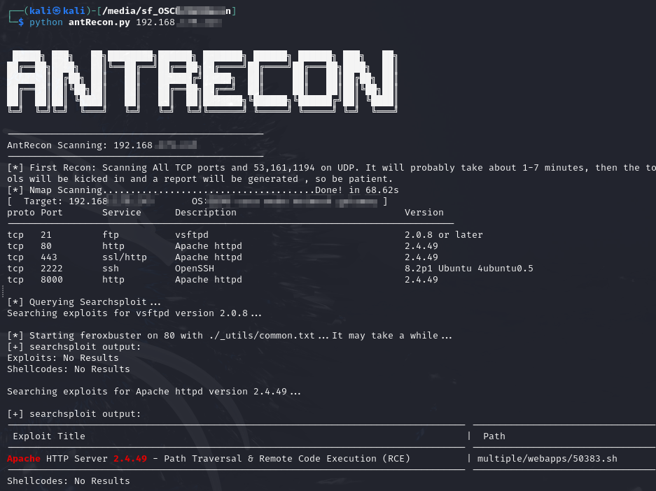
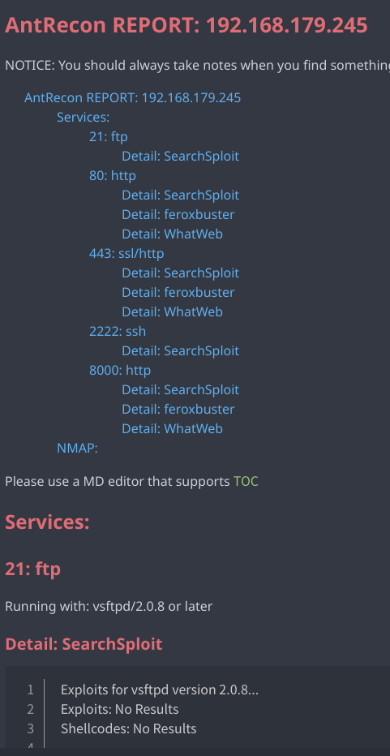

# AntRecon

Automated recon tool for **OSCP** and **HTB**

Automated single target **Recon** and **Markdown scan report** generation.

## Usage

No complex parameters and options. 

**All you need to do is enter the target.** You don't need to remember anything else.

```
python antRecon.py <ip or domain>
```

But only **ONE** target at a time.

Tested on kali and some other linux distributions, python 3.11-12.
Tested in OSCP's challenge lab and some HTB boxes. 
For my own use. Works fine for me. 

## Dependencies & Install

- nmap
- dig
- smtp-user-enum
- feroxbuster
- whatweb
- enum4linux
- searchsploit

On kali, you only need to install **feroxbuster**:

```
pip install python-nmap
sudo apt install feroxbuster

(and clone this tool)
```

It **won't stop** working if some of the tools are **missing**. Despite this, I recommend that you install the full range of tools


## Details: What can it do for you?

**It's important to know what your tools can do. You need to know what your tools do for you and what they don't do. What was accurate and what wasn't.**

- Detect [all TCP + some UDP] ports and services, version, OS, SSL(for http/https and domain name)
  - `-T4 -sS -sU -p U:53,161,1194,T:1-65535 -sV --allports -O --script ssl-cert`
- Running tools aganist detected services:
  - dig (axfr)
  - smtp-user-enum (`VRFY` with username.txt in `_utils`)
  - feroxbuster ( Enum web dirs. Using `common.txt`,  also scan for `.pdf .txt`, recursive=2) 
  - whatweb (aggressive mode)
  - enum4linux (-a)
  - searchsploit (may not that accurate)

2. Nmap script scan. Enumrate services like snmp, ftp null session, smtp etc.  
  - `-T4 -sS -sU -p U:53,161,1194,T:1-65535 -sV -O --script "(default or auth or vuln or discovery) and not (http-enum or TLS-*)" --script-args mincvss=5.0 --script-timeout 240s`
  - The advice provided by ‘script vulners’  can be ignored in the vast majority of cases
3. Generate a `report` for you.

Also for **function extent**, you can add your own tools. Just write the code in the format of` *Handler.py` in the `_utils` folder and add the tools and corresponding services in `toolsList.py`.






**Eh, do not use for unauthorized penetration testing and it’s actually not that suitable for real world pentest.**

